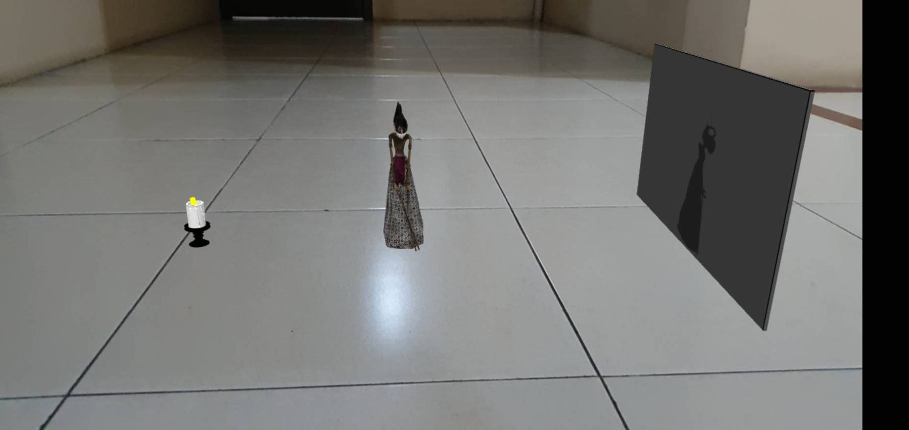

# Wayang
Spawn Wayang, a traditional form of puppet theatre play originally found in the cultures of Java, Indonesia, on a plane in-front of your camera.

Try it out: https://www.instagram.com/ar/2252247328417723/

  
  

## Inspiration
Indonesia is a beautiful country with thousands of cultures deeply rooted in its history. Yet sadly, according to a survey conducted by the Indonesian Ministry of Education and Culture, only 0.31% of Indonesian participate in any traditional theatre or "pedalangan" as we call it [1]. One of Indonesia's oldest theatrical performances is Wayang which was originally found in the cultures of Java, Indonesia. It involves telling a dramatic story through shadows thrown by puppets.

## What it does
This AR effect will spawn Wayang, a traditional form of puppet theatre play originally found in the cultures of Java, Indonesia, on a plane in front of your camera. It also spawns a wall and a candle that will project the wayang's shadow onto the wall. You can tap the screen to turn on/off the light. We design it to mimic the experience of how it was done traditionally. Traditionally, the wayang gets upscaled in size, and through the shadow, a puppeteer tells its story.

## How I built it
I used a 3D model of Wayang Golek Arjuna by The Seweryn Udziela Ethnographic Museum in Kraków & RDW MIC, Małopolska’s Virtual Museums project[2], and I reduce the amount of vertices in order to make it fit into the Instagram's size requirement. Next, I combine the 3D wayang model with a simple wall and candle[3]. I then learned how to create texture and photoshopped a shadow of the wayang's model to both sides of the wall. Lastly, I stitch the model, a traditional gamelan sound, and on/off ambient & directional light patch on SparkAR Studio.

#### References:
[1] Indonesian Ministry of Education and Culture. (2016). Analisis Partisipasi Kebudayaan. Data and Statistics Center for Education and Culture. URL: http://publikasi.data.kemdikbud.go.id/uploadDir/isi_6B964F97-8196-45DA-95B7-715095411517_.pdf
[2] Wayang Golek Arjuna 3D Model by The Seweryn Udziela Ethnographic Museum in Kraków and RDW MIC, Małopolska’s Virtual Museums project. URL: https://sketchfab.com/3d-models/arjuna-wayang-golek-theatre-puppet-3043564cc38b49aa8b08a61ce68dd61a
[3] Candle 3D model by frostcorestudios. URL: https://free3d.com/3d-model/candle-717529.html
